<p align="center">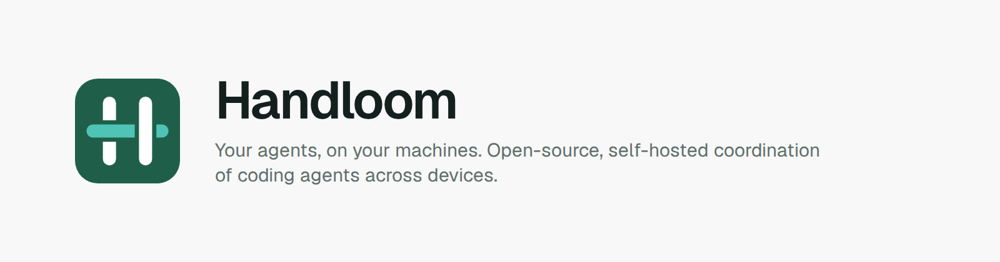</p>

<p align="center">
  <a href="https://github.com/afiffattouh/handloom/actions/workflows/ci.yml"></a>
  <a href="LICENSE"></a>
  
</p>

**Handloom runs jobs made of coding agents on your own machines.** You describe a job. A lead agent plans it and starts workers. Each worker gets its own copy of the repository. The machine that holds the files checks the work. You review it and close the job. One small hub keeps the record; every machine only calls out to it, so nothing needs an open port.

<p align="center">
  <picture>
    <source media="(prefers-color-scheme: dark)" srcset="docs/img/command-dark.png">
    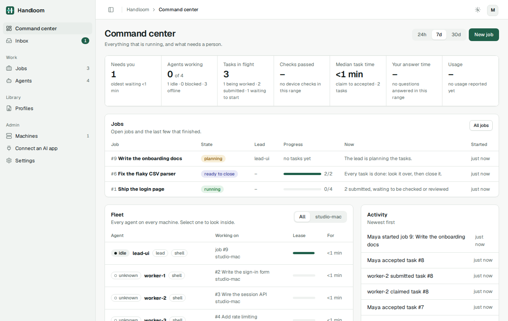
  </picture>
</p>

## Contents

[What you get](#what-you-get) · [How it works](#how-it-works) · [Quick start](#quick-start) · [Install](#install) · [Uninstall](#uninstall) · [Ways to use it](#ways-to-use-it) · [Teams](#teams) · [Client knowledge](#client-knowledge) · [Agent CLIs](#agent-clis) · [Guard rails](#guard-rails) · [Run it yourself](#run-it-yourself) · [Status](#status) · [Documentation](#documentation) · [Contributing](#contributing)

## What you get

| | |
| --- | --- |
| **Jobs with a lead** | Each job has its own lead agent, a team of workers, tasks with owners and dependencies, and a brief that says what done looks like. |
| **Profiles and skills** | What an agent may do and know, as versioned, hash-pinned profiles: tools, denied commands, allowed paths, skills. 41 ready-made starters (engineering, design, research, consulting, marketing, sales, finance, HR) and a form that asks "what should it do?" in plain words. |
| **Any agent CLI, any model** | Claude Code, Codex, OMP, Pi and OpenCode, including models running on your own machine. Handloom limits each as far as that CLI allows and says plainly what it cannot enforce. |
| **Proof, not claims** | A task is submitted with evidence. The device runs the job's check, refuses edits outside the profile's paths, merges accepted work into an integration branch and re-checks it. A lead cannot accept failed work. |
| **Only people approve** | Starting and closing jobs, answering questions and writing profiles need a signed-in person. Agents, devices and AI apps cannot. |
| **Web, terminal, CLI, MCP** | A server-rendered web UI, a full-screen terminal console, every action as a command, and an MCP server so your own AI app can look at your work and start jobs. |
| **Client knowledge** | A knowledge repository per client that agents read first; what they learn comes back as a proposal on a branch that only you merge. |

<table>
  <tr>
    <td width="50%">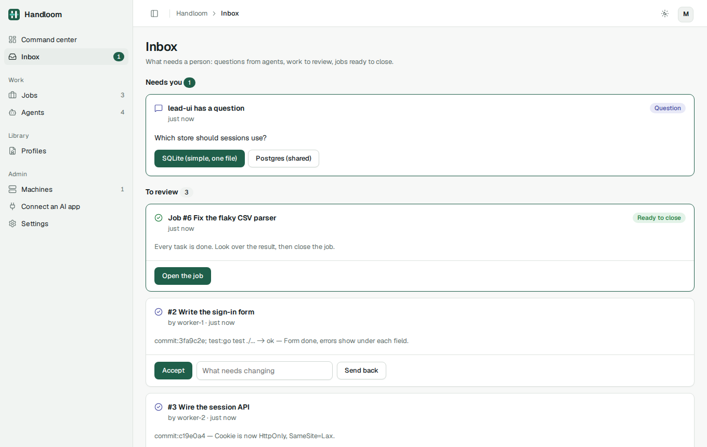</td>
    <td width="50%">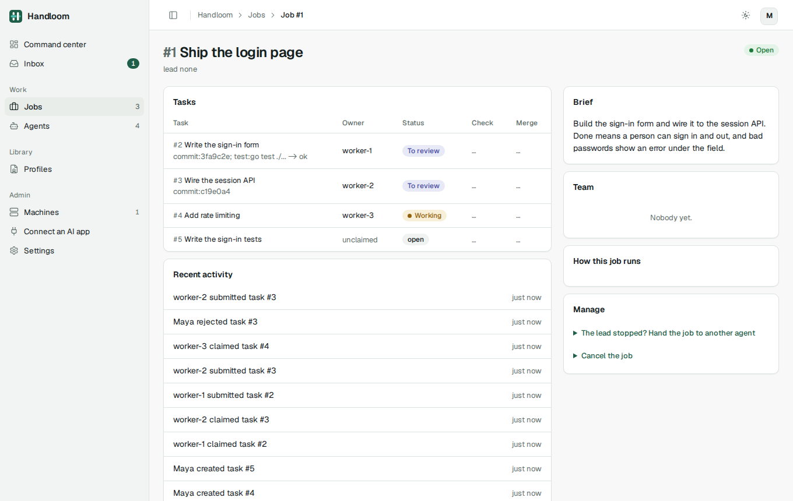</td>
  </tr>
  <tr>
    <td align="center"><sub><b>Inbox.</b> What needs a person, in one place, live.</sub></td>
    <td align="center"><sub><b>A job.</b> Every task with its owner, evidence and check.</sub></td>
  </tr>
  <tr>
    <td width="50%">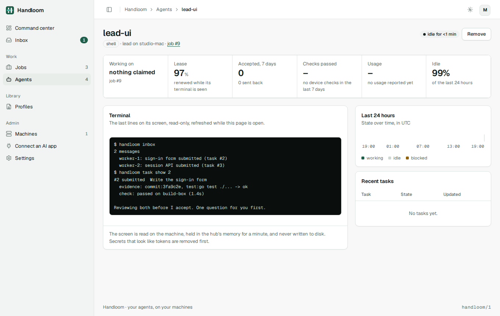</td>
    <td width="50%">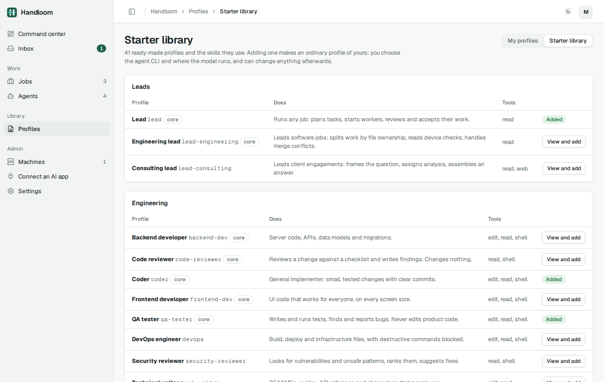</td>
  </tr>
  <tr>
    <td align="center"><sub><b>An agent.</b> Its state, lease, and a read-only view of its terminal.</sub></td>
    <td align="center"><sub><b>Starter library.</b> Ready-made roles, each with its skills.</sub></td>
  </tr>
</table>

## How it works

<p align="center">
  <picture>
    <source media="(prefers-color-scheme: dark)" srcset="docs/img/topology-dark.png">
    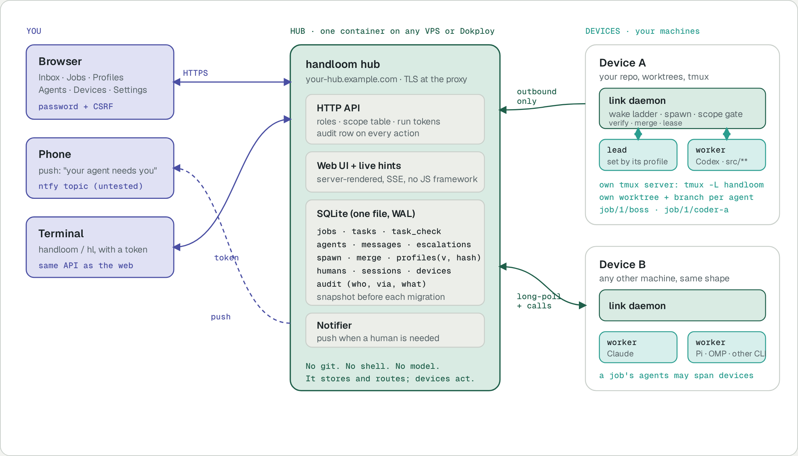
  </picture>
</p>

1. **You start a job** in the web UI, the console or the CLI: a title, a brief, a machine, optionally a repository and a check command.
2. **The lead plans it.** The hub records a spawn request; the link on that machine makes a git worktree, opens a tmux window and starts the lead from its profile. The lead creates tasks and asks the link to start workers.
3. **Workers build in their own worktrees** and submit with evidence. The link refuses a submit that touches files outside the profile's paths, then runs the job's check.
4. **The lead reviews.** It can accept only work whose check passed. The link merges accepted branches into `job/<id>/integration` and re-checks; a conflict goes back to the lead.
5. **You decide.** Questions land in your inbox (and on your phone). When every task is done you look at the result, close the job, and merge the integration branch yourself. Nothing touches your own branches.

The hub never runs git, a shell or a model, so it can be small and public. Everything that runs code lives on machines you own, and the device's word beats the agent's word.

**One job, from your sentence to a branch you can merge.** Read down: each box sits in the lane of whoever does it, and dashed boxes are waiting, not working.

<p align="center">
  <picture>
    <source media="(prefers-color-scheme: dark)" srcset="docs/img/flow-dark.png">
    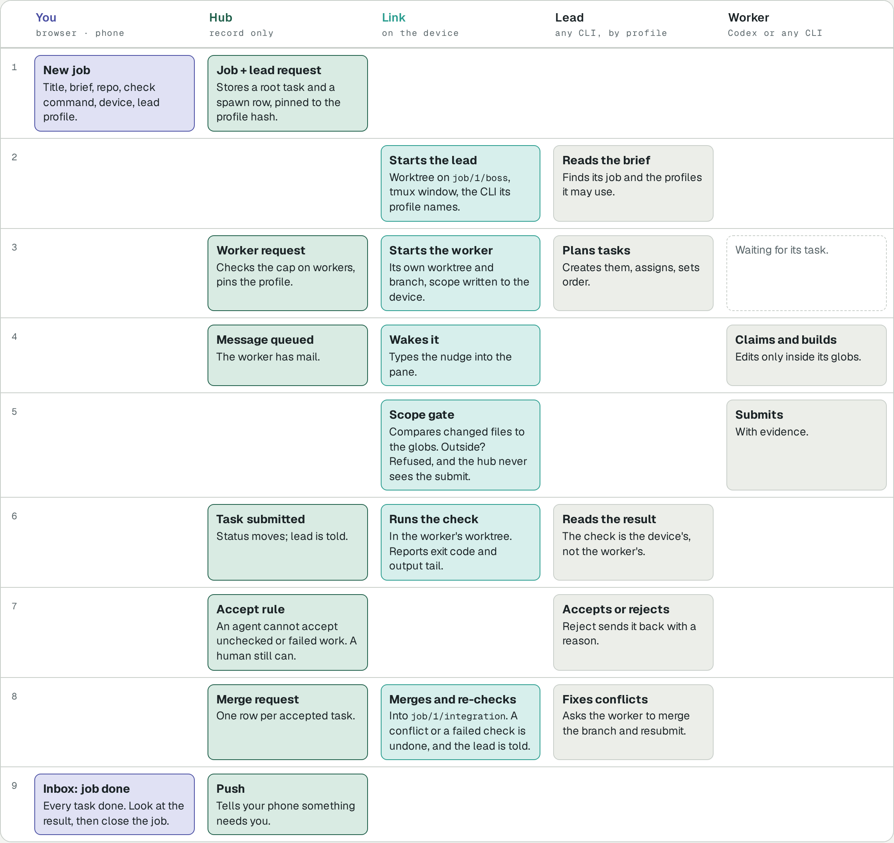
  </picture>
</p>

At any step an agent can ask you a question. It lands in your inbox and on your phone, and only you can answer it. If the lead goes quiet its lease runs out, the job shows "lead lost", and you can hand it to another agent.

**Who is responsible for what.** The split is deliberate: the hub can be public and small because it never touches a repository.

<p align="center">
  <picture>
    <source media="(prefers-color-scheme: dark)" srcset="docs/img/layers-dark.png">
    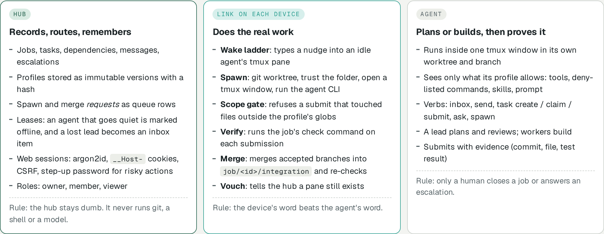
  </picture>
</p>

## Quick start

Four stages, each done once. The long version, with the domain, https and every token explained, is [docs/setup.md](docs/setup.md).

**1. Run the hub** on any server with Docker:

```bash
# a DNS A record for handloom.example.com pointing at the server; ports 80 and 443 open
HANDLOOM_DOMAIN=handloom.example.com docker compose -f docker-compose.caddy.yml up -d --build
docker compose -f docker-compose.caddy.yml logs handloom | grep -E "Admin token|setup code"
```

Open `https://handloom.example.com/setup`, enter the setup code and make your owner account. Keep the admin token somewhere safe. On Dokploy, see [docs/deploy.md](docs/deploy.md).

**2. Join each machine** that will run agents. In the web UI go to Machines, Add a machine, and paste the one command it shows on that machine. It installs Handloom if needed, joins the hub, keeps the link running (as a service, or in tmux where there is no systemd) and checks the machine, saying what to fix. The page shows the machine as **ready** when it is.

```bash
curl -fsSL https://raw.githubusercontent.com/afiffattouh/handloom/main/install.sh | sh -s -- join https://handloom.example.com <join-token>
```

Already have the program? `handloom join https://handloom.example.com <join-token>` does the same. The machine needs `git`, `tmux` and at least one logged-in agent CLI (Claude Code, Codex, OMP, Pi or OpenCode); if something is missing the command prints the exact install command for your system. Other ways to install the program (Homebrew, packages, a container) are under [Install](#install).

**3. Add profiles.** In the web UI: Profiles, Starter library, add a lead and a worker and choose their CLI. Or from the command line:

```bash
handloom starters                                                    # the 41 ready-made roles
handloom profile add coder --kind claude --runtime cloud
handloom profile make scout --can research --kind omp --runtime local --model <your-local-model>
```

**4. Start a job.** Jobs, New job: a title, a brief, the machine, the repository and check command, and the lead's profile. The lead starts the workers. The inbox shows a Get started checklist until all four stages are done.

> **Security.** Anyone who can post to your hub can in effect run code on every connected machine, and agents often run without approval prompts. Use https or a private network, a strong owner password, and revoke machines you no longer use. See [SECURITY.md](SECURITY.md).

## Install

Every release has binaries, packages and a signed checksum file on the [releases page](https://github.com/afiffattouh/handloom/releases).

| Route | Platforms | Notes |
| --- | --- | --- |
| `install.sh` | Linux, macOS (amd64, arm64) | Checks the download against `checksums.txt` (and its Sigstore signature if `cosign` is installed). Installs to `/usr/local/bin` if you can write there, else `~/.local/bin`. Never uses sudo. |
| Homebrew | macOS, Linux | `brew tap afiffattouh/handloom https://github.com/afiffattouh/handloom && brew install handloom` |
| `.deb`, `.rpm` | Linux (amd64, arm64) | Installs `handloom` and `hl` in `/usr/bin`. |
| Tarball or zip | Linux, macOS, Windows | Unpack and put `handloom` on your PATH. |
| Container image | Linux (amd64, arm64) | `ghcr.io/afiffattouh/handloom`, for the hub. |
| From source | anywhere Go runs | `go build -o handloom ./cmd/handloom` |

**Windows** gets the command line, the terminal console (`handloom tui`) and the MCP server, to use a hub that runs elsewhere. The link (the part that starts agents) needs tmux and is not supported on Windows. The Windows build has not been tried on a Windows machine.

**Verifying a download.** The checksums are signed by the release workflow with Sigstore, and every file has a build provenance attestation:

```bash
cosign verify-blob --bundle checksums.txt.sigstore.json \
  --certificate-identity-regexp '^https://github.com/afiffattouh/handloom/.github/workflows/release.yml@refs/' \
  --certificate-oidc-issuer https://token.actions.githubusercontent.com checksums.txt
sha256sum -c checksums.txt --ignore-missing
gh attestation verify handloom_<version>_linux_amd64.tar.gz -R afiffattouh/handloom
```

## Uninstall

```bash
handloom uninstall --dry-run        # says exactly what it would remove
handloom uninstall                  # stops and removes the link and hub services and the program
handloom uninstall --purge          # also deletes the link's folder (its credential, work trees, logs, your saved console sign-in) and stops the agents' tmux server
```

It never touches a hub's data folder or backups, your repositories, or the `.handloom` folders agents' adapters wrote into projects. If the machine was joined to a hub, also revoke it there (web UI: Machines, Revoke) so its credential stops working. A program installed by Homebrew or a package is left for its package manager (`brew uninstall handloom`, `apt remove handloom`, `dnf remove handloom`); removing the `.deb` or `.rpm` also stops and removes the services `handloom link install` wrote. To remove the hub's container: `docker compose down` (add `-v` only if you want the data gone).

## Ways to use it

<table>
  <tr>
    <td width="50%" valign="top">
      <b>Web UI</b><br>
      The command center, inbox, jobs, agents, profiles, machines and settings. Light and dark, works on a phone, live updates, copy buttons on every token and command.
    </td>
    <td width="50%" valign="top">
      <b>Terminal console</b><br>
      <code>handloom login https://your-hub</code> once, then <code>handloom tui</code>: overview, inbox (accept, send back, answer, each after a y/n), jobs with a new-job form, agents with their terminals, library. See <a href="docs/tui.md">docs/tui.md</a>.
    </td>
  </tr>
  <tr>
    <td width="50%" valign="top">
      <b>Command line</b><br>
      Everything the web UI does is also a command: <code>handloom job new</code>, <code>task accept</code>, <code>people</code>, <code>prices</code>, <code>metrics</code>, <code>screen</code>, <code>token new</code>. <code>handloom help</code> lists them all.
    </td>
    <td width="50%" valign="top">
      <b>Your own AI app (MCP)</b><br>
      Let Claude or Codex look at your work and start jobs: the web UI's <i>Connect an AI app</i> page makes a token the hub limits to reading and starting work, and shows the settings to paste. It cannot approve anything. See <a href="docs/mcp.md">docs/mcp.md</a>.
    </td>
  </tr>
</table>

<p align="center">
  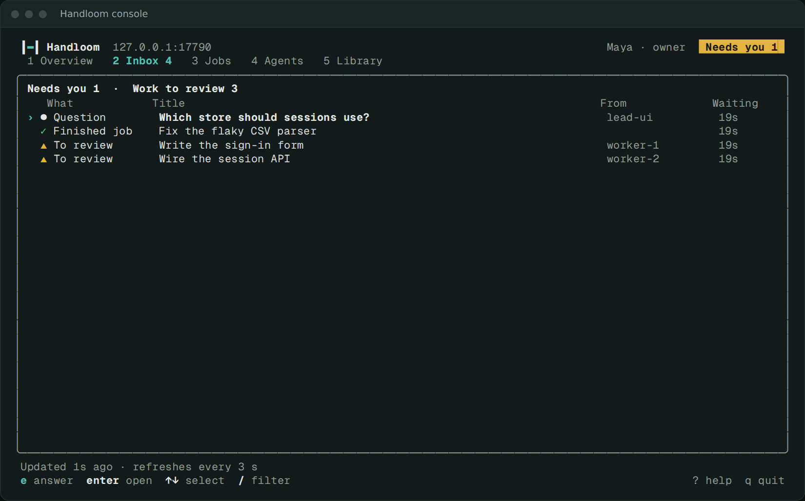
</p>

## Teams

One hub serves one team. Everyone signs in to the same web UI and everyone's machines can join it. The owner invites people (an invite link, their own password) and decides what each can touch.

<p align="center">
  <picture>
    <source media="(prefers-color-scheme: dark)" srcset="docs/img/teams-dark.png">
    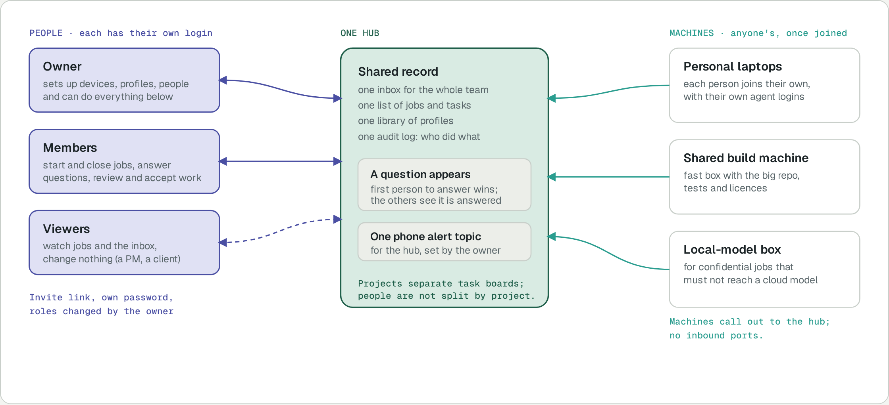
  </picture>
</p>

| Action | Owner | Member | Viewer |
| --- | :---: | :---: | :---: |
| See jobs, tasks, inbox, activity | yes | yes | yes |
| Start and close jobs | yes | yes | no |
| Answer an agent's question | yes | yes | no |
| Accept or send back submitted work | yes | yes | no |
| Start an agent by hand | yes | yes | no |
| Create and edit profiles | yes | no | no |
| Add or revoke machines | yes | no | no |
| Invite people, change roles, set alerts | yes | no | no |

Agents are not people: they can never start or close a job, answer a question or change a profile, whoever started them.

**A day in a team**

<p align="center">
  <picture>
    <source media="(prefers-color-scheme: dark)" srcset="docs/img/team-day-dark.png">
    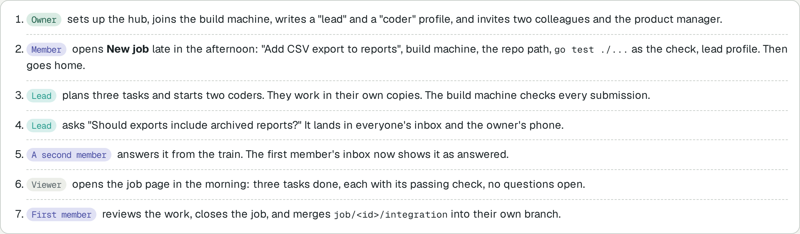
  </picture>
</p>

**Ways to organise it**

- **One team, one hub.** The default. Everyone shares the inbox and the machines.
- **Just you, several machines.** The same product with one person: a laptop, a desktop and a server, one inbox on your phone.
- **A separate hub per trust boundary.** Only when a contract says client data must not share a system. Most teams do not need this: separate clients by job, repository and knowledge repository.

**What a team should know today.** There is no per-person or per-team isolation inside one hub: every signed-in person sees every job, and every member can start a job on any joined machine. The profile is the limit, and only the owner writes profiles. A machine belongs to the hub, not to a person. There is one alert topic for the whole hub. See [#13](https://github.com/afiffattouh/handloom/issues/13).

## Client knowledge

Each client gets one knowledge repository: markdown notes in git that link to each other with `[[links]]`. Agents read it before they work. What they learn comes back as a **proposal** on a branch, and only a person merges it. The hub never holds the notes, only a count.

<p align="center">
  <picture>
    <source media="(prefers-color-scheme: dark)" srcset="docs/img/knowledge-dark.png">
    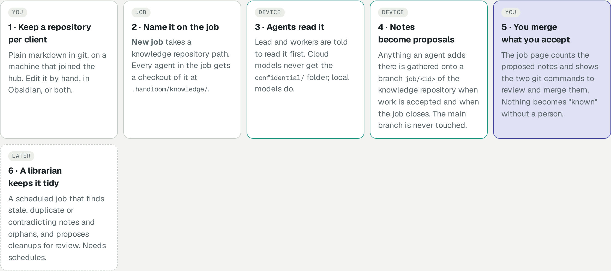
  </picture>
</p>

```
acme-knowledge/                  # one repository per client, owned by you
  clients/acme.md                # "Invoice prefix: ACM. Billing contact: Dana. See [[contract-terms]]"
  decisions/2026-10-invoice-ids.md
  confidential/                  # local-model agents only; never checked out for a cloud model
    contract-terms.md
branch job/12                    # what job 12's agents proposed; you review it, then merge it
```

Continuing a project: a job points at an existing repository and starts from its latest commit; to build on unmerged work, give it a base branch such as `job/12/integration`. The hub sees the knowledge repository's path and a count of proposed notes, not the notes or their file names; back those up with git. A librarian that keeps the notes tidy is planned ([#7](https://github.com/afiffattouh/handloom/issues/7)).

## Agent CLIs

A profile names the CLI and where its model runs (cloud or local). Each CLI enforces different things; the profile form and `handloom profile add` say what will and will not be enforced instead of refusing.

| CLI | Model on your own machine | Refuses specific commands | Skills | Web tool |
| --- | :---: | :---: | --- | :---: |
| Claude Code | cloud models | yes | native | yes |
| Codex | cloud models | no (always has a shell) | in its instructions | yes |
| OMP | yes | no (always has a shell) | in its instructions | yes |
| Pi | yes | no (always has a shell) | in its instructions | no |
| OpenCode | yes | yes | in its instructions | yes |

For a CLI that cannot refuse commands, "never run risky commands" becomes a standing rule in the agent's instructions: asked, not blocked, and the profile page says so.

## Guard rails

- **Only people approve.** Accepting work, answering questions, closing jobs and writing profiles are refused for agents, devices and AI-app tokens, whatever they are configured to auto-approve.
- **The device checks, not the agent.** The check command runs on the machine that holds the files; its exit code sits next to the agent's own claim.
- **Scope is enforced at submit.** Edits outside a profile's allowed paths are refused and logged.
- **Profiles are pinned.** A spawn runs `name@version` by hash. Editing a profile makes a new version.
- **Agents never hold a credential.** They talk to the link over a unix socket with a per-run token stored hashed on the hub.
- **Confidential material stays local.** The terminal view is off for confidential jobs unless the hub is set up for it, and agents on cloud models never get the `confidential/` folder of a knowledge repository.
- **Everything is audited**, append-only: who did what, and through which door.

## Run it yourself

- **Docker, behind Caddy:** the quick start above. One image, one volume; accounts, jobs and profiles live in one SQLite file, snapshotted before every migration. `handloom hub backup` and `restore` are built in.
- **Dokploy or any compose host:** [docs/deploy.md](docs/deploy.md): a compose app that you deploy from your own machine, or from Git if you prefer.
- **A private network, no domain:** `scripts/setup.sh hub <ssh-name>` runs the hub as a systemd service on a Tailscale address (plain HTTP: keep it private), and `scripts/setup.sh device <ssh-name> --hub <url>` does the same for each machine.
- **Build:** `go build -o bin/handloom ./cmd/handloom`; `go test ./...`. One static binary, cross-compile with `CGO_ENABLED=0 GOOS=linux GOARCH=amd64 go build ...`.
- **Recovery** (on the hub's own machine): `handloom hub reset-password`, `reset-human-token`, `reset-admin-token`, `create-owner`.

## Status

Handloom is used for real work by its author and is pre-1.0. Honest about what is and is not proven:

- **Proven with real agents:** Claude Code, Codex, OMP, Pi and OpenCode as workers; Claude Code and OMP as leads; parallel workers; a forced merge conflict resolved by a lead; fully local jobs on a local model. Evidence is in [docs/evidence](docs/evidence) and [DECISIONS.md](DECISIONS.md).
- **Proven on a clean machine:** a Linux amd64 VPS with nothing of Handloom on it: install from a release, join, run the link as a service, register an agent, then `handloom uninstall --purge` left the machine identical to before.
- **Not proven yet:** phone push against a real ntfy topic; macOS (the link needs tmux and has only been run on Linux so far); the Windows build (command line, console and MCP only) has not been run on Windows.
- **Planned, tracked as [issues](https://github.com/afiffattouh/handloom/issues):** published binaries and an install script, a remote MCP endpoint, container isolation, schedules and a knowledge librarian.

## Documentation

| | |
| --- | --- |
| [docs/setup.md](docs/setup.md) | Step-by-step setup: domain, https, tokens, first job |
| [docs/overview.html](docs/overview.html) | The whole picture on one page: topology, architecture, flow, teams, knowledge (open in a browser) |
| [docs/tui.md](docs/tui.md) · [docs/mcp.md](docs/mcp.md) | The terminal console · using Handloom from an AI app |
| [docs/protocol.md](docs/protocol.md) | The API, version `handloom/1` |
| [docs/deploy.md](docs/deploy.md) · [docs/isolation.md](docs/isolation.md) | Deploying · the container-mode design |
| [docs/design-principles.md](docs/design-principles.md) · [docs/brand.md](docs/brand.md) | The UI's rules · the name, logo, colours and voice |
| [docs/durability.md](docs/durability.md) | What survives a crash, a restart, a restore and an upgrade, and the test behind each claim |
| [docs/direction](docs/direction/README.md) | Where Handloom goes for teams and enterprises: the research, the review committee and the proposed bets |
| [DECISIONS.md](DECISIONS.md) | Every choice made, with what was and was not tested |

```
cmd/handloom/       main                       internal/tui/     the terminal console
internal/hub/       API, web UI, scopes, audit internal/link/    device daemon, wake ladder, spawn, checks, merges
internal/store/     SQLite schema, migrations  internal/profile/ profiles, per-CLI capabilities
internal/cli/       verbs and commands         internal/starters/ the 41 starters
internal/mcp/       MCP server (agent, operator) adapters/       per-CLI instruction snippets and shims
```

## Contributing

Issues and pull requests are welcome; start with [CONTRIBUTING.md](CONTRIBUTING.md). Report vulnerabilities privately, see [SECURITY.md](SECURITY.md).

## Licence

Apache-2.0. See [LICENSE](LICENSE).
